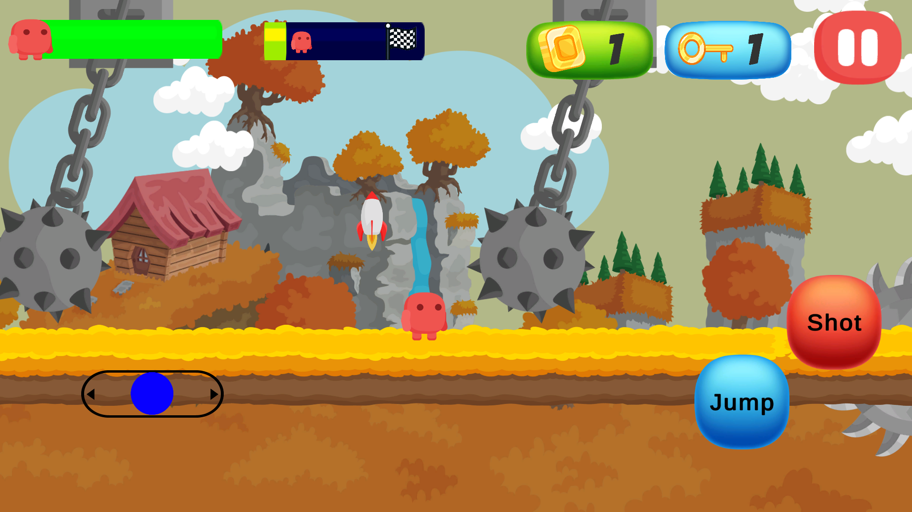

# Red in Sky: A 2D Mobile Platform Game

Red in Sky is a 2D platform game developed as part of the **Game Design and Development** course project. Inspired by classic platformers like Super Mario, this game provides an engaging experience with unique characters, dynamic environments, and challenging levels.

## 🚀 **Game Overview**
In Red in Sky, players control the main character, **Red**, on a mission to rescue his kidnapped partner. The adventure unfolds across multiple levels with different themes, obstacles, and enemies.

### **Features**
- **Dynamic Gameplay**: Navigate through obstacles, defeat enemies, and collect power-ups.
- **Diverse Environments**: Summer, Spring, Winter, and Cloud-themed levels.
- **Challenging Enemies**:
  - **Mace**: Swings back and forth on a fixed path.
  - **Saw**: Moves along a predetermined route.
  - **Spike**: Static but harmful upon contact.
  - **Enemy**: Causes damage to the player unless defeated.

- **Game Elements**:
  - **Power-ups**: Enhance gameplay with health boosters, jump enhancers, and speed boosts.
  - **Player HUD**: Displays health, keys, and collected gold.
  - **End-of-Level Flags**: Marks successful level completion.
  - **Death Screen**: Triggers on character death, offering retry options.

## 🎮 **Game Controls**
- **Joystick**: Move left and right.
- **Jump Button**: Makes Red jump.
- **Fire Button**: Attack enemies.

## 🛠️ **Development Tools**
- **Game Engine**: Unity
- **Programming Language**: C#
- **Graphics Tools**: Adobe Illustrator and Photoshop
- **IDE**: Visual Studio Code

## 🖌️ **Level Design**
Each level increases in complexity, introducing new enemy behaviors and more intricate environments. The initial levels teach the player mechanics, while later levels challenge their skills.

### **Screenshots**
Here are screenshots from various stages and menus in the game:

- **Autumn Level**  
  
  
- **Level Menu**  
  
  
- **Main Menu**  
  
  
- **Pause Menu**  
  
  
- **Settings Menu**  
  
  
- **Summer Level**  
  
  
- **Summer Level 2**  
  
  
- **Winter Level**  
  

## 🌟 **Future Enhancements**
1. **New Levels**: Expand gameplay with additional stages.
2. **Character Variety**: Introduce more playable characters.
3. **Story Integration**: Embed a deeper narrative.
4. **Advanced Enemy Behaviors**: Add movement and attack patterns.
5. **In-Game Store**: Enable in-game purchases for upgrades.
6. **Play Store Launch**: Publish the game on the Google Play Store.

## 🔉 **Audio Features**
- **Sound Effects**: Jumping, collecting items, defeating enemies, and more.
- **Background Music**: Plays during levels and in the main menu.

## 📂 **Project Structure**
- **Scenes**:
  - Main Menu
  - Level Selection
  - Six game levels
- **Prefabs**: All objects (characters, obstacles, environment) are reusable prefabs.
- **Scripts**: Modular and organized for specific functionalities.

## 📚 **Learning Resources**
- **Unity Tutorials**: BTK Academy’s "Unity ile Dijital Oyun Geliştirmeye Giriş."
- **Problem Solving**: Online forums, YouTube tutorials, and AI tools.

## 📊 **Project Outcome**
The Red in Sky project has enhanced our understanding of game design principles, Unity development, and problem-solving in game mechanics. It provided practical exposure and serves as a solid foundation for future game development projects.

---

### **License**
This project is licensed under the MIT License - see the [LICENSE](LICENSE) file for details.
